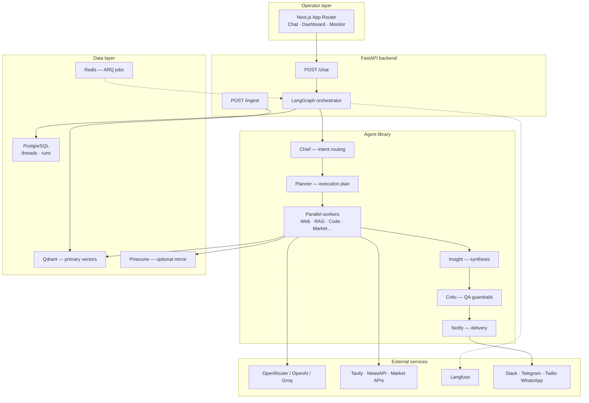
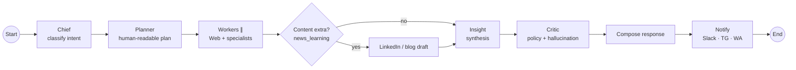

# Venkat AI Platform (VAP)

[](LICENSE)
[](https://langchain-ai.github.io/langgraph/)
[]()

**Principal-architect multi-agent operating system** — Chief routes intent, specialist agents run in parallel, Critic guards output, notifications fan out to Slack, Telegram, and WhatsApp.

> A portfolio-grade reference for **LangGraph orchestration**, **multi-LLM routing**, **dual-vector RAG**, **Langfuse observability**, and **production persistence** — with publication-ready ADRs and design docs.

[📖 Principal design doc](docs/PRINCIPAL_AI_ARCHITECT_DESIGN_DOCUMENT.md) · [🏗 Architecture catalog](docs/ARCHITECTURE.md) · [📋 Charter / memory](docs/PRIMARY_REQUIREMENT_MEMORY.md)

---

## Why this exists

Single-chat LLM wrappers cannot model how principal architects actually work: route intent, parallelize research, synthesize insight, critique before delivery, and notify across channels.

VAP is a **multi-agent orchestration platform** with:

| Capability | Implementation |
|------------|----------------|
| Intent routing | Chief orchestrator — 13+ intent labels |
| Parallel evidence | asyncio worker bundles per intent |
| RAG | Qdrant primary + optional Pinecone dual-write |
| QA gate | CriticAgent before external delivery |
| Persistence | Postgres threads, messages, workflow runs |
| Schedules | Redis + ARQ cron for daily briefs |
| Observability | Langfuse spans on critical nodes |

---

## 60-second overview

```text
User → Chief → Planner → Parallel Workers → Content → Insight → Critic → Notify
                                              ↘ Slack · Telegram · WhatsApp
```

---

## Architecture

### System context



### LangGraph workflow (runtime)



### Chief intent routing

| Intent | Agent bundle (high level) |
|--------|---------------------------|
| `news_learning` | Web + NewsResearch + optional LinkedIn draft |
| `prototype_idea` | Web + PrototypeBuilder + Code |
| `market_analysis` | Web + MarketIntelligence *(not financial advice)* |
| `rag_query` | Web + Knowledge (Qdrant) |
| `enterprise_api` | Web + API integration patterns |
| `security_review` | SecurityReviewAgent — STRIDE checklist |
| `compliance` | ComplianceAgent — licensing / privacy flags |
| `general` | Knowledge + Code + Web freshness |

Full catalog: [docs/ARCHITECTURE.md](docs/ARCHITECTURE.md)

---

## Stack decisions

| Concern | Choice | Notes |
|---------|--------|-------|
| Orchestration | LangGraph | Testable nodes, graph introspection |
| LLM access | OpenRouter default | Swappable via env |
| Embeddings | OpenAI / Cohere | `EMBEDDING_PROVIDER` |
| Primary vector | Qdrant | Docker-friendly dev parity |
| Secondary vector | Pinecone optional | Best-effort dual-write |
| Persistence | Postgres + Alembic | Threads, messages, runs |
| Jobs | Redis + ARQ | Scheduled daily brief |
| Observability | Langfuse | Spans on chief / planner / critic |

---

## Quick start

### 1. Infrastructure

```bash
docker compose up -d postgres redis qdrant
```

### 2. Backend

```bash
cd backend
python -m venv .venv && source .venv/bin/activate
pip install -e ".[dev]"
cp ../.env.example .env
# Set OPENROUTER_API_KEY or OPENAI_API_KEY
uvicorn app.main:app --reload --port 8000
```

### 3. Frontend

```bash
cd frontend
cp .env.example .env.local
npm install && npm run dev
```

### 4. Try it

- UI: http://localhost:3000/chat
- API: `POST http://localhost:8000/chat` with `{"message":"...","notify_channels":["slack"]}`

---

## Project structure

```text
venkat-ai-platform/
├── frontend/           # Next.js — chat, dashboard, monitor, settings
├── backend/
│   ├── app/agents/     # Chief, Planner, Web, Knowledge, Critic, …
│   ├── app/orchestrator/  # LangGraph graph.py
│   ├── alembic/        # Postgres migrations
│   └── app/worker/     # ARQ scheduled jobs
├── docs/               # Principal architect design docs + ADRs
├── infra/              # Deployment references
└── docker-compose.yml  # Postgres, Redis, Qdrant
```

---

## Documentation (principal-architect bar)

| Document | Purpose |
|----------|---------|
| [PRINCIPAL_AI_ARCHITECT_DESIGN_DOCUMENT.md](docs/PRINCIPAL_AI_ARCHITECT_DESIGN_DOCUMENT.md) | Tradeoffs, risks, cost, scale — publication-ready |
| [ARCHITECTURE.md](docs/ARCHITECTURE.md) | Runtime architecture + agent catalog |
| [PRIMARY_REQUIREMENT_MEMORY.md](docs/PRIMARY_REQUIREMENT_MEMORY.md) | Durable charter for humans + agents |

---

## Compliance

Market and portfolio outputs are **informational only** — not investment advice. Add your own disclaimers before external distribution.

---

## Related projects

| Project | Role |
|---------|------|
| [aegisai-enterprise-agent-platform](https://github.com/vpeetla-ai/aegisai-enterprise-agent-platform) | Agent governance control plane — gateway + HITL |
| [ai-content-factory](https://github.com/vpeetla-ai/ai-content-factory) | Content pipeline with HITL publish gate |
| [enterprise_rag_platform](https://github.com/vpeetla-ai/enterprise_rag_platform) | Enterprise RAG governance patterns |

Built by [Venkata Peetla](https://github.com/vpeetla-ai) — [venkat-ai.com](https://venkat-ai.com)

⭐ Star if this reference architecture helps your multi-agent work.
