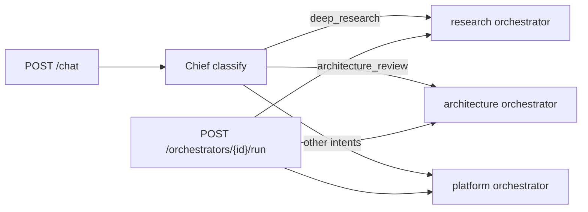
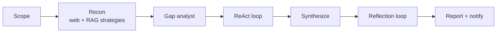
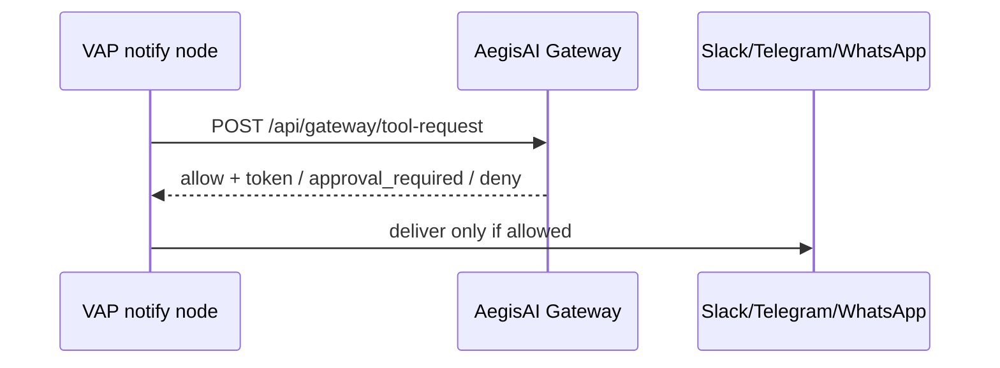
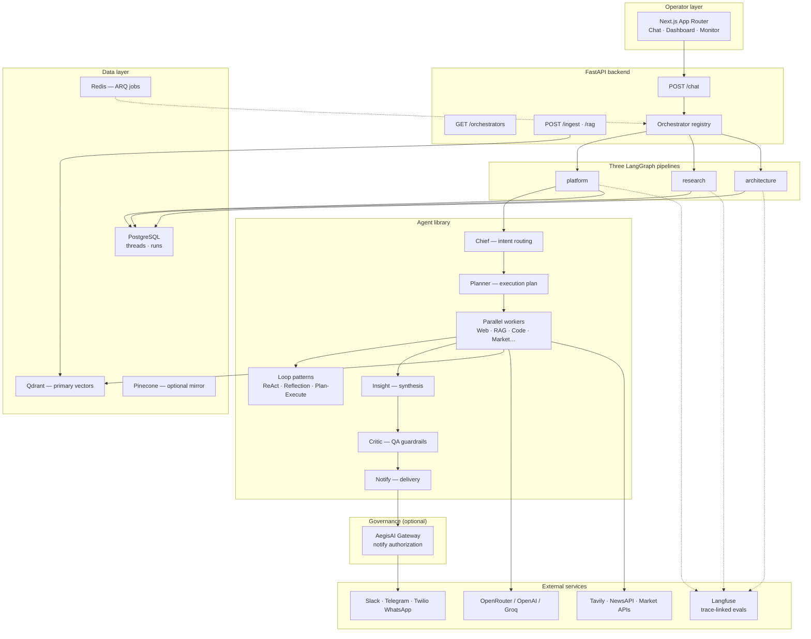
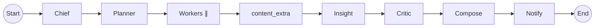

# Venkat AI Platform (VAP)


<!-- vpeetla-tech-stack:start -->
[]() []() []() []() []() []() []() []() []() []()
<!-- vpeetla-tech-stack:end -->
## Agent skills (Cursor + Codex)

Org skills: [vpeetla-ai-skills](https://github.com/vpeetla-ai/vpeetla-ai-skills). This repo includes `.cursor/skills/`, `AGENTS.md`, and `CONTEXT.md`.

```bash
git clone https://github.com/vpeetla-ai/vpeetla-ai-skills.git
./vpeetla-ai-skills/scripts/install.sh --cursor --codex --project .
```

---

[](https://venkat-ai-platform.vercel.app)
[](LICENSE)
[](https://langchain-ai.github.io/langgraph/)
[](https://qdrant.tech/)

**Job of the system:** route intent, run specialists in parallel, critique before anything leaves, notify channels — the multi-agent *operating system*. Governance (policy, HITL, signed audit) lives next door in AegisAI; VAP calls the gateway at side-effect edges instead of owning the constitution.

This repo is the **pattern**. It is not Lucid's production binary. Orchestration stays separate from the gateway on purpose.

> Chief classifies → specialists work → Critic gates → Slack / Telegram / WhatsApp. LangGraph orchestration, multi-LLM routing, Qdrant RAG, Langfuse when configured, Postgres persistence.

[▶ Live demo](https://venkat-ai-platform.vercel.app) · [📖 Principal design doc](docs/PRINCIPAL_AI_ARCHITECT_DESIGN_DOCUMENT.md) · [🏗 Architecture catalog](docs/ARCHITECTURE.md) · [🔗 Ecosystem map](docs/ECOSYSTEM.md) · [🚀 Deploy guide](docs/LIVE_DEMO.md)

**Portfolio:** [Case study](https://github.com/vpeetla-ai/ai-architecture-portfolio/blob/main/case-studies/venkat-ai-platform.md) · [Tradeoffs](docs/PRODUCT.md)

## Why this exists

A single-chat wrapper can't model how I'd actually work: classify the ask, parallelize research, synthesize, critique before delivery, fan out to channels.

VAP is that orchestration layer:

| Capability | Implementation |
|------------|----------------|
| Intent routing | Chief orchestrator — 16 intent labels + 3 orchestrators |
| Parallel evidence | asyncio worker bundles per intent |
| RAG architectures | 7 strategies (naive, hybrid, multi-query, HyDE, rerank, parent-doc, enterprise) |
| Loop patterns | ReAct, Reflection, Plan-Execute (`agents/loops/`) |
| QA gate | CriticAgent (LLM review) before external delivery |
| Persistence | Postgres threads, messages, workflow runs |
| Schedules | Redis + ARQ cron for daily briefs |
| Observability | Langfuse spans on critical nodes |

**What VAP is not:** the enterprise governance control plane. Pair with [AegisAI](https://github.com/vpeetla-ai/aegisai-enterprise-agent-platform) for policy, HITL queues, signed audit, and fleet registry. Demo may run without gateway URL set; notify governance is live when `AEGISAI_API_BASE_URL` is configured.

---

## Implementation status (honest)

| Component | Status |
|-----------|--------|
| LangGraph orchestrator (9 linear nodes) | ✅ Platform pipeline |
| Deep Research orchestrator | ✅ Recon + ReAct + reflection |
| Architecture Review orchestrator | ✅ Specialists + plan-execute + reflection |
| Chief intent routing (16 labels) | ✅ Auto-routes to orchestrators |
| RAG strategy library (7 patterns, incl. Enterprise RAG adapter) | ✅ `GET /rag/strategies` |
| Loop pattern agents | ✅ ReAct, Reflection, Plan-Execute |
| Automated test suite | ✅ `pytest` in `backend/tests/` |
| Postgres thread persistence | ✅ |
| Langfuse spans (chief/planner/critic) | ✅ | Set `LANGFUSE_*` — [infra/README.md](infra/README.md) |
| Ops metrics compose planes | ✅ | `GET /api/v1/ops/metrics` exposes LLM gateway + AegisAI notify + Langfuse posture + HITL deep-link |
| Observability status | ✅ | `GET /api/v1/ops/observability/status` — orchestration vs AegisAI HITL SoT honesty |
| Pinecone | 🟡 Ingest mirror only |
| AegisAI gateway (notify) | ✅ When `AEGISAI_API_BASE_URL` set — see [ECOSYSTEM.md](docs/ECOSYSTEM.md) |
| LLM gateway plane | ✅ When `LLM_GATEWAY_URL` set — VAP **selects** buckets; [aegis-llm-gateway](https://github.com/vpeetla-ai/aegis-llm-gateway) **enforces+records** (ADR-028/029); else direct providers |
| Approval gateway / HITL UI | 🟡 Deep-link — Demo banner → [AegisAI HITL queue](https://aegisai-enterprise-agent-platform.vercel.app/?view=product&module=hitl) (`?view=product&module=hitl`); VAP does not host a duplicate approval UI |
| API-key gate on `/chat`, `/orchestrators/*/run`, `/ingest`, `/rag/retrieve`, `/threads/*/messages` | ✅ Set `VAP_API_KEY` on Render — these routes call an LLM, write to the vector DB, send real Slack/Telegram/WhatsApp notifications, or read chat history, and previously had no auth dependency at all — see [ai-architecture-portfolio ADR-009](https://github.com/vpeetla-ai/ai-architecture-portfolio/blob/main/adr/ADR-009-vap-auth-gate.md) |
| Durable scheduled-job queue | 🟡 ARQ + Redis only — a pending daily-brief job is lost if Redis is unavailable when it fires |

**What VAP is not:** an enterprise governance control plane. For policy, HITL queues, signed audit, and fleet registry, use [aegisai-enterprise-agent-platform](https://github.com/vpeetla-ai/aegisai-enterprise-agent-platform).

---

## Three orchestrators

| Orchestrator | Intent | Sub-agents / loops |
|--------------|--------|-------------------|
| **Platform** (default) | `general`, `rag_query`, `news_learning`, … | Parallel workers + critic |
| **Deep Research** | `deep_research` | Web, RagExpert, gap analyst, ReAct, reflection |
| **Architecture Review** | `architecture_review` | Security, compliance, RAG, plan-execute, reflection |

```bash
curl -X POST http://localhost:8000/chat -H 'Content-Type: application/json' \
  -d '{"message":"Deep research on enterprise agent governance"}'

curl -X POST http://localhost:8000/orchestrators/research/run \
  -H 'Content-Type: application/json' \
  -d '{"message":"Compare LangGraph vs custom orchestrators for FinOps"}'
```

[RAG architectures](docs/RAG_ARCHITECTURES.md) · [Full architecture](docs/ARCHITECTURE.md)

### Orchestrator routing



### Deep Research pipeline



### AegisAI gateway (notify)

When `AEGISAI_API_BASE_URL` is set, delivery channels request authorization before sending:



---

## 60-second overview

```text
User → Chief → Planner → Parallel Workers → Content → Insight → Critic → Notify
                                              ↘ Slack · Telegram · WhatsApp
         ↘ Langfuse (system / trace / node spans + eval scores)
```

---

## Architecture

Canonical: [`docs/diagrams/canonical-architecture.mmd`](docs/diagrams/canonical-architecture.mmd)

### System context



### LangGraph workflow (runtime — linear graph)

The graph is **sequential** (no conditional edges). `content_extra` only drafts LinkedIn/blog copy when `intent == news_learning`; otherwise it passes through.



### Chief intent routing

| Intent | Agent bundle (high level) |
|--------|---------------------------|
| `news_learning` | Web + NewsResearch + optional LinkedIn draft |
| `prototype_idea` | Web + PrototypeBuilder + Code |
| `market_analysis` | Web + MarketIntelligence *(not financial advice)* |
| `rag_query` | Web + Knowledge (hybrid RAG) |
| `rag_expert` | All 7 RAG strategies compared |
| `deep_research` | → **research** orchestrator |
| `architecture_review` | → **architecture** orchestrator |
| `enterprise_api` | Web + API integration patterns |
| `security_review` | SecurityReviewAgent — STRIDE checklist |
| `compliance` | ComplianceAgent — licensing / privacy flags |
| `general` | Knowledge + Code + Web freshness |

Full catalog: [docs/ARCHITECTURE.md](docs/ARCHITECTURE.md)

---

## Stack decisions

| Concern | Choice | Notes |
|---------|--------|-------|
| Orchestration | LangGraph | Testable nodes, graph introspection |
| LLM access | OpenRouter default | Swappable via env |
| Embeddings | OpenAI / Cohere | `EMBEDDING_PROVIDER` |
| Primary vector | Qdrant | Docker-friendly dev parity |
| Secondary vector | Pinecone optional | Ingest mirror only — queries use Qdrant |
| Persistence | Postgres + Alembic | Threads, messages, runs |
| Jobs | Redis + ARQ | Scheduled daily brief |
| Observability | Langfuse | Spans on chief / planner / critic |

---

## Quick start

### 1. Infrastructure

```bash
docker compose up -d postgres redis qdrant
```

### 2. Backend

```bash
cd backend
python -m venv .venv && source .venv/bin/activate
pip install -e ".[dev]"
cp ../.env.example .env
# Set OPENROUTER_API_KEY or OPENAI_API_KEY
uvicorn app.main:app --reload --port 8000
```

### 3. Frontend

```bash
cd frontend
cp .env.example .env.local
npm install && npm run dev
```

### 4. Try it

- UI: http://localhost:3000/chat
- API: `POST http://localhost:8000/chat` with `{"message":"...","notify_channels":["slack"]}`

---

## Project structure

```text
venkat-ai-platform/
├── frontend/           # Next.js — chat, dashboard, monitor, settings
├── backend/
│   ├── app/agents/     # Chief, Planner, Web, Knowledge, Critic, …
│   ├── app/orchestrator/  # platform · research · architecture graphs
│   ├── app/integrations/  # AegisAI gateway client
│   ├── app/agents/loops/  # ReAct · Reflection · Plan-Execute
│   ├── alembic/        # Postgres migrations
│   └── app/worker/     # ARQ scheduled jobs
├── docs/               # Principal architect design docs + ADRs
├── infra/              # Deployment references
└── docker-compose.yml  # Postgres, Redis, Qdrant
```

---

## Documentation (principal-architect bar)

| Document | Purpose |
|----------|---------|
| [PRINCIPAL_AI_ARCHITECT_DESIGN_DOCUMENT.md](docs/PRINCIPAL_AI_ARCHITECT_DESIGN_DOCUMENT.md) | Tradeoffs, risks, cost, scale — publication-ready |
| [ARCHITECTURE.md](docs/ARCHITECTURE.md) | Runtime architecture + mermaid diagrams |
| [RAG_ARCHITECTURES.md](docs/RAG_ARCHITECTURES.md) | Six retrieval patterns |
| [ECOSYSTEM.md](docs/ECOSYSTEM.md) | VAP ↔ AegisAI pairing |
| [PRIMARY_REQUIREMENT_MEMORY.md](docs/PRIMARY_REQUIREMENT_MEMORY.md) | Durable charter for humans + agents |

---

## Compliance

Market and portfolio outputs are **informational only** — not investment advice. Add your own disclaimers before external distribution.

---

## Interview map

**Business function:** Multi-agent OS — intent routing, parallel specialists, critic, multi-channel notify.

Staff+ prep crosswalk — [playbook](https://github.com/vpeetla-ai/ai-architect-interview-playbook) · [study UI](https://ai-architect-interview-playbook.vercel.app) · [Practice Arena](https://ai-architect-practice-arena.vercel.app) · [org matrix](https://github.com/vpeetla-ai/ai-architecture-portfolio/blob/main/docs/REPO_INTERVIEW_MAP.md). Only entries this repo honestly exercises.

| Category | Entry | Fit |
|----------|-------|-----|
| System design | [Agent tool-use / orchestration](https://ai-architect-interview-playbook.vercel.app/q/ai-system-design/03-agent-tool-use-orchestration-platform/) ([md](https://github.com/vpeetla-ai/ai-architect-interview-playbook/blob/main/ai-system-design/03-agent-tool-use-orchestration-platform.md)) | Core: LangGraph orchestrators + tool side effects via gateway |
| System design | [Durable long-running agents](https://ai-architect-interview-playbook.vercel.app/q/ai-system-design/13-durable-long-running-agent-execution/) ([md](https://github.com/vpeetla-ai/ai-architect-interview-playbook/blob/main/ai-system-design/13-durable-long-running-agent-execution.md)) | Partial — threaded runs, HITL resume, persistence |
| Cloud | [LLM gateway / model routing](https://ai-architect-interview-playbook.vercel.app/q/cloud-architecture/07-llm-gateway-semantic-cache-model-router/) ([md](https://github.com/vpeetla-ai/ai-architect-interview-playbook/blob/main/cloud-architecture/07-llm-gateway-semantic-cache-model-router.md)) | Apps select; gateway enforces (ADR-029); tool notify still via AegisAI |
| Trade-offs | [Cost vs latency vs safety](https://ai-architect-interview-playbook.vercel.app/q/scalability-governance-tradeoffs/01-cost-vs-latency-vs-safety/) ([md](https://github.com/vpeetla-ai/ai-architect-interview-playbook/blob/main/scalability-governance-tradeoffs/01-cost-vs-latency-vs-safety.md)) | Routing / model choice under budget |
| Trade-offs | [Centralize vs federate governance](https://ai-architect-interview-playbook.vercel.app/q/scalability-governance-tradeoffs/03-centralize-vs-federate-governance/) ([md](https://github.com/vpeetla-ai/ai-architect-interview-playbook/blob/main/scalability-governance-tradeoffs/03-centralize-vs-federate-governance.md)) | Orchestration here; policy in AegisAI |
| Behavioral | [Leading a 0→1 AI product](https://ai-architect-interview-playbook.vercel.app/q/behavioral/05-leading-a-0-to-1-ai-product-build/) ([md](https://github.com/vpeetla-ai/ai-architect-interview-playbook/blob/main/behavioral/05-leading-a-0-to-1-ai-product-build.md)) | Platform build under ambiguity |

## Related projects

See [docs/ECOSYSTEM.md](docs/ECOSYSTEM.md) for how repos connect.

| Project | Role |
|---------|------|
| [aegisai-enterprise-agent-platform](https://github.com/vpeetla-ai/aegisai-enterprise-agent-platform) | Governance control plane — gateway + HITL (pair with VAP) |
| [aegis-llm-gateway](https://github.com/vpeetla-ai/aegis-llm-gateway) | Shared LLM completions plane — set `LLM_GATEWAY_URL` |
| [aegis-semantic-cache](https://github.com/vpeetla-ai/aegis-semantic-cache) | Tenant-isolated semantic cache (used by LLM gateway) |
| [ai-content-factory](https://github.com/vpeetla-ai/ai-content-factory) | Content pipeline with HITL publish gate |
| [enterprise_rag_platform](https://github.com/vpeetla-ai/enterprise_rag_platform) | Enterprise RAG governance patterns |

Built by [Venkata Peetla](https://github.com/vpeetla-ai) — [venkat-ai.com](https://venkat-ai.com)

⭐ Star if this reference architecture helps your multi-agent work.
