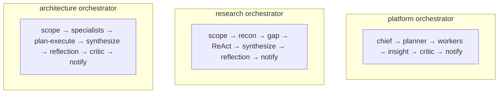
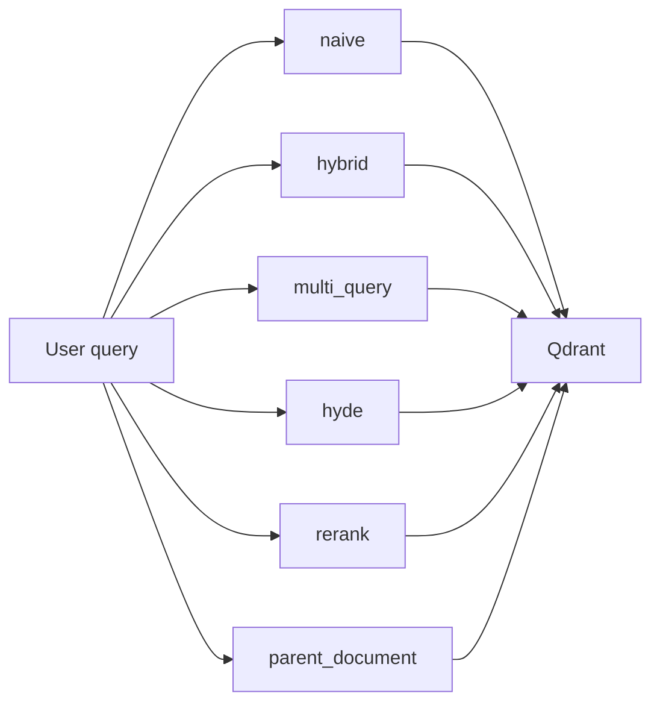
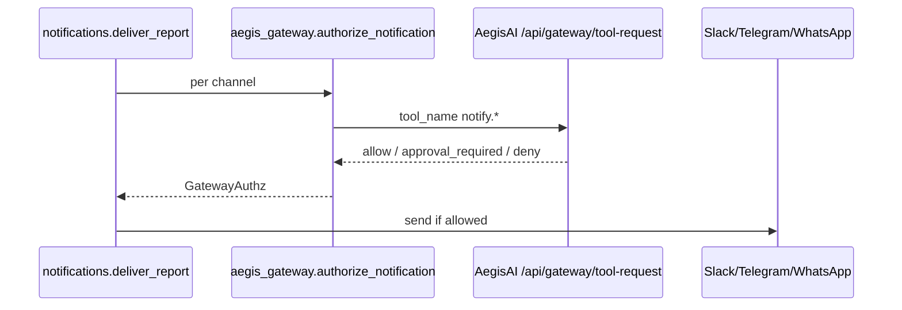
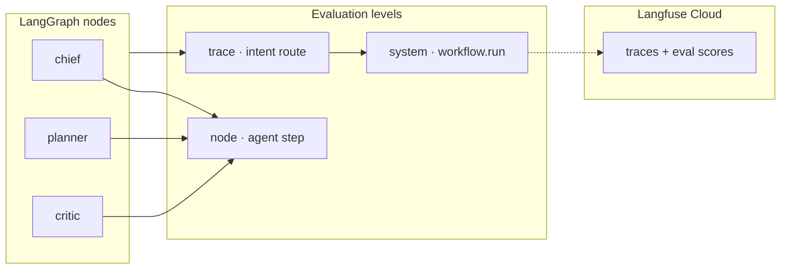

# Venkat AI Platform — Architecture & Agent Catalog

## Publication & governance

- **Principal design document:** `docs/PRINCIPAL_AI_ARCHITECT_DESIGN_DOCUMENT.md` (tradeoffs, risks, cost, scale).  
- **Durable charter / “memory” anchor:** `docs/PRIMARY_REQUIREMENT_MEMORY.md` + `.cursor/rules/vap-principal-architect-bar.mdc`.
- **Protocol stack (2026):** [MCP tool layer](MCP.md) · [Inference + vLLM lab](INFERENCE.md) · [A2A Agent Cards](A2A.md)

## Stack decisions (Principal AI Architect view)

| Concern | Choice | Notes |
|---------|--------|------|
| Orchestration | LangGraph | Explicit graph for portfolio demos + testable nodes |
| LLM access | OpenRouter default | Single integration surface; Groq/OpenAI switches via env |
| Embeddings | OpenAI default | Swap to Cohere with `EMBEDDING_PROVIDER=cohere` |
| Primary vector | Qdrant | Docker-friendly, predictable latency |
| Secondary vector | Pinecone (optional) | Ingest mirror only — reads always from Qdrant |
| Persistence | Postgres | `chat_threads`, `chat_messages`, `workflow_runs` |
| Jobs | Redis + ARQ | Scheduled daily brief (`app/worker/settings.py`) |
| Observability | Langfuse | Trace-linked spans on chief/planner/critic — [org spec](https://github.com/vpeetla-ai/ai-architecture-portfolio/blob/main/docs/TRACE_LINKED_OBSERVABILITY.md) |
| Notifications | Slack / Telegram / Twilio WhatsApp | WhatsApp via Meta Cloud API can plug in similarly |

## Orchestrators (multi-pipeline)

VAP ships **three LangGraph orchestrators** — auto-routed by Chief intent or forced via `POST /chat` `orchestrator` field / `POST /orchestrators/{id}/run`.

| ID | Trigger intents | Pipeline |
|----|-----------------|----------|
| `platform` | default (general, news_learning, rag_query, …) | Chief → workers → insight → critic → notify |
| `research` | `deep_research` | Scope → recon (web + all RAG strategies) → gap analysis → **ReAct loop** → synthesize → **reflection loop** |
| `architecture` | `architecture_review` | Security + compliance + RAG + web → **plan-execute loop** → synthesize → reflection → critic |

Registry: `backend/app/orchestrator/registry.py`



## Loop engineering patterns

Reusable modules in `backend/app/agents/loops/`:

| Pattern | Module | Use in VAP |
|---------|--------|------------|
| **ReAct** | `react_loop.py` | Deep Research orchestrator — tool loop (web, rag_search) |
| **Reflection** | `reflection_loop.py` | Research + Architecture orchestrators — draft/critique/improve |
| **Plan-Execute** | `plan_execute_loop.py` | Architecture orchestrator — numbered steps + synthesis |

Aligns with [Production Agent Patterns](https://github.com/vpeetla-ai/ai-content-factory/tree/main/docs/agent-patterns) (ReAct, Reflection, Plan-Execute).

## RAG architectures

All strategies in `backend/app/memory/rag_strategies.py` — exposed via `GET /rag/strategies`, `POST /rag/retrieve`, and **RagExpertAgent**.

| Strategy | Description |
|----------|-------------|
| `naive` | Vector top-k (baseline) |
| `multi_query` | LLM query variants → merge results |
| `hybrid` | Vector + keyword scoring (default for KnowledgeAgent) |
| `parent_document` | Chunk search → return `parent_text` from ingest metadata |
| `rerank` | Over-fetch + LLM rerank |
| `hyde` | Hypothetical document embedding |

Ingest parent-doc RAG: include `metadata.parent_id` and `metadata.parent_text` in `POST /ingest` chunks.

Details: [docs/RAG_ARCHITECTURES.md](RAG_ARCHITECTURES.md)



## AegisAI gateway integration



Config: `AEGISAI_API_BASE_URL`, `AEGISAI_AGENT_ID=venkat-ai-platform`, `AEGISAI_PRINCIPAL_ID=vap-orchestrator`. See [ECOSYSTEM.md](ECOSYSTEM.md).

## Observability (trace-linked LLMOps)



Set `LANGFUSE_PUBLIC_KEY` + `LANGFUSE_SECRET_KEY` on Render. Package: `backend/app/vpeetla_observability/`.

## LangGraph flow (platform orchestrator)

```
START → chief → planner → workers → content_extra → insight → critic → compose → notify → END
```

**Linear graph** — no conditional LangGraph edges. Branching happens *inside* nodes (e.g. `content_extra` only drafts when `intent == news_learning`).

- **chief:** intent classification (see **Chief intents** below).  
- **planner:** textual execution plan for humans / UI.  
- **workers:** `asyncio` parallel bundle per intent (always includes **WebAgent** for freshness).  
- **content_extra:** LinkedIn/blog draft when intent is `news_learning`; no-op otherwise.  
- **insight / critic:** synthesis + LLM QA guardrails (not an approval gateway — see [ECOSYSTEM.md](ECOSYSTEM.md)).  
- **compose / notify:** final response + Slack / Telegram / WhatsApp delivery.

Source: `backend/app/orchestrator/graph.py`

## Chief intents (routing labels)

`general`, `news_learning`, `prototype_idea`, `market_analysis`, `rag_query`, `rag_expert`,  
`deep_research`, `architecture_review`, `enterprise_api`,  
`portfolio_risk`, `calendar_commitments`, `budget_telemetry`, `security_review`, `compliance`,  
`meeting_brief`, `experiment`.

## Core agents (implementation types)

| Agent | Type | Notes |
|-------|------|-------|
| **ChiefOrchestrator** | LLM classifier | `agents/chief.py` — 16 intent labels |
| **PlannerAgent** | LLM | Human-readable plan (`agents/planner.py`) |
| **KnowledgeAgent** | Tool-backed RAG | Qdrant retrieval (`agents/knowledge.py`) |
| **WebAgent** | Tool-backed | Tavily when `TAVILY_API_KEY` set |
| **APIAgent** | LLM patterns | Enterprise REST/GraphQL guidance |
| **CodeAgent** | LLM | Implementation support |
| **InsightAgent** | LLM | Executive synthesis |
| **ContentAgent** | LLM | Social/blog drafting |
| **CriticAgent** | LLM review | Policy/hallucination check — not HITL gateway |

## Extended agents (personal OS)

| Agent | Type | Notes |
|-------|------|-------|
| **NewsResearchAgent** | Tool + LLM | NewsAPI + Web synthesis |
| **PrototypeBuilderAgent** | LLM | MVP scope, architecture, tickets |
| **MarketIntelligenceAgent** | Tool + LLM | **Not financial advice** |
| **PortfolioRiskAgent** | LLM | Scenario education — **not financial advice** |
| **CalendarCommitmentsAgent** | LLM + optional file | `CALENDAR_CONTEXT_PATH` |
| **BudgetTelemetryAgent** | LLM + optional file | `BUDGET_SUMMARY_PATH` |
| **SecurityReviewAgent** | LLM checklist | STRIDE-style review |
| **ComplianceAgent** | LLM | Licensing/privacy flags |
| **MeetingBriefAgent** | LLM + optional file | `MEETING_CONTEXT_PATH` |
| **ExperimentAgent** | LLM | Eval design patterns |

Worker bundle selection: `backend/app/orchestrator/graph.py` (`SPECIALISTS` dict).

## Production hardening (in-repo)

| Capability | Location |
|-----------|----------|
| Alembic migrations | `backend/alembic/` |
| Chat persistence API | `POST /chat` + `GET /threads/{id}/messages` |
| Scheduled brief | `arq app.worker.settings.WorkerSettings` |
| Pinecone mirror | install `pip install -e ".[pinecone]"`, set `PINECONE_*` — ingest only |

## HTTP API (runtime)

| Route | Purpose |
|-------|---------|
| `POST /chat` | Run workflow; optional `orchestrator` field |
| `GET /orchestrators` | List orchestrators |
| `POST /orchestrators/{id}/run` | Invoke specific pipeline |
| `GET /rag/strategies` | List RAG architecture names |
| `POST /rag/retrieve` | Test a RAG strategy |
| `GET /threads/{id}/messages` | Thread history from Postgres |
| `POST /ingest` | Upsert chunks to Qdrant (+ optional Pinecone mirror) |
| `GET /health` | Liveness |

## Ecosystem alignment

VAP answers **what agents should do**. For **what agents are allowed to do** (gateway, OPA policy, HITL queue, signed audit, fleet registry), pair with **[AegisAI](https://github.com/vpeetla-ai/aegisai-enterprise-agent-platform)** — see [ECOSYSTEM.md](ECOSYSTEM.md).

| Capability | VAP | AegisAI |
|------------|-----|---------|
| Orchestration | ✅ | — |
| LLM critic before notify | ✅ | — |
| Gateway-wrapped notify | ✅ | HITL queue + resume |
| Tool intercept + FinOps | — | ✅ |

## Phase mapping (honest status)

| Phase | Status in repo |
|-------|----------------|
| 1 Foundation | ✅ Monorepo, docker-compose, README |
| 2 Frontend | ✅ Chat + settings; 🟡 dashboard/monitor placeholders |
| 3 Backend foundation | ✅ FastAPI layout, schemas, routes |
| 4 LLM router | ✅ `llm/router.py`, `factory.py` (`bucket_for_intent` defined, routing uses env defaults) |
| 5 LangGraph | ✅ Linear 9-node graph (`orchestrator/graph.py`) |
| 6 RAG | ✅ `/ingest`, Qdrant; Pinecone ingest mirror optional |
| 7 Observability | ✅ Langfuse spans on chief/planner/critic |
| 8 Enterprise | 🟡 Salesforce stub route only |
| 9 Content engine | ✅ ContentAgent for `news_learning` |
| 10 Advanced | ❌ Voice, marketplace, MCP — future |
| 11 Governance integration | ✅ Notify via `app/integrations/aegis_gateway.py` |

## Data ingestion

`POST /ingest` with `{ "chunks": [{ "id": "...", "text": "...", "metadata": {} }] }` upserts vectors into **Qdrant** and (if configured) mirrors to **Pinecone**. Retrieval always reads from Qdrant.

## Privacy & safety

- Never ship market commentary without disclaimers and human review for external audiences.  
- Slack/Telegram/WhatsApp credentials are **server-side only**; the UI only toggles which channels to request.
