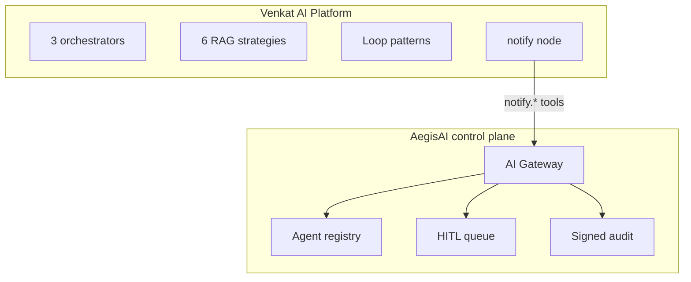

# Venkat AI Ecosystem — How the repos fit together

This document aligns **[Venkat AI Platform (VAP)](https://github.com/vpeetla-ai/venkat-ai-platform)** (orchestration) with **[AegisAI](https://github.com/vpeetla-ai/aegisai-enterprise-agent-platform)** (governance) and sibling projects.

---

## The two-question split

| Question | Repo | Role |
|----------|------|------|
| **What should agents do?** | **This repo (VAP)** | LangGraph orchestration — Chief routes intent, workers run in parallel, Critic reviews output |
| **What are agents allowed to do?** | [aegisai-enterprise-agent-platform](https://github.com/vpeetla-ai/aegisai-enterprise-agent-platform) | Governance control plane — AI Gateway, policy, HITL, signed audit, FinOps |



**Today:** Slack/Telegram/WhatsApp delivery goes through AegisAI when `AEGISAI_API_BASE_URL` is configured (`app/integrations/aegis_gateway.py`). Each notify channel requests `POST /api/gateway/tool-request` before sending.

```bash
AEGISAI_API_BASE_URL=https://aegisai-api.onrender.com
AEGISAI_AGENT_ID=venkat-ai-platform
AEGISAI_PRINCIPAL_ID=vap-orchestrator
AEGISAI_GATEWAY_FAIL_OPEN=true   # direct delivery if gateway unreachable (local dev)
```

**Next:** ingest writes, ReAct tools, and ai-content-factory publish through the gateway.

---

## What VAP implements vs defers

| Capability | In VAP today | Deferred to AegisAI |
|------------|--------------|---------------------|
| Intent routing (16 labels) | Chief agent | — |
| Three orchestrators | platform / research / architecture | — |
| Gateway-wrapped notifications | `aegis_gateway.py` | HITL queue UI for pending approvals |
| OPA / RBAC policy engine | No | `platform/policy/aegisai.rego` |
| Signed audit packets | No | Audit export API |
| Agent registry lifecycle | No | Shadow → Approved |
| Kill switch | No | Platform kill switch |

---

## VAP runtime graph (source of truth)

Linear LangGraph — all nodes run each turn; `content_extra` no-ops unless `intent == news_learning`:

```
START → chief → planner → workers → content_extra → insight → critic → compose → notify → END
```

Code: `backend/app/orchestrator/graph.py`

---

## Integration checklist (VAP → AegisAI)

1. Register: `agent_id=venkat-ai-platform` via AegisAI registry API
2. Wrap `backend/app/services/notifications.py` delivery through gateway SDK
3. High-risk intents → request `approval_required` before external publish
4. Emit `workflow_run_id` into AegisAI audit events

Full matrix: [AegisAI ECOSYSTEM.md](https://github.com/vpeetla-ai/aegisai-enterprise-agent-platform/blob/main/docs/ECOSYSTEM.md)

---

## Observability

Langfuse spans on chief, planner, and critic nodes. Set `LANGFUSE_*` in `.env` or Render — see [infra/README.md](../infra/README.md).

Shared org pattern: [TRACE_LINKED_OBSERVABILITY](https://github.com/vpeetla-ai/ai-architecture-portfolio/blob/main/docs/TRACE_LINKED_OBSERVABILITY.md). Package synced at `backend/app/vpeetla_observability/` for future middleware wiring.

---

## Sibling projects

| Repo | Relationship |
|------|--------------|
| [aegisai-enterprise-agent-platform](https://github.com/vpeetla-ai/aegisai-enterprise-agent-platform) | Governance layer for VAP tool calls |
| [aegis-llm-gateway](https://github.com/vpeetla-ai/aegis-llm-gateway) | Shared LLM completions — set `LLM_GATEWAY_URL` |
| [ai-content-factory](https://github.com/vpeetla-ai/ai-content-factory) | Application-layer content automation |
| [enterprise_rag_platform](https://github.com/vpeetla-ai/enterprise_rag_platform) | Governed knowledge layer — VAP `enterprise` RAG strategy calls `/v1/retrieve` |

---

## Reading order

1. [docs/PRINCIPAL_AI_ARCHITECT_DESIGN_DOCUMENT.md](./PRINCIPAL_AI_ARCHITECT_DESIGN_DOCUMENT.md)
2. [docs/ARCHITECTURE.md](./ARCHITECTURE.md)
3. [AegisAI ARCHITECTURE.md](https://github.com/vpeetla-ai/aegisai-enterprise-agent-platform/blob/main/platform/architecture/ARCHITECTURE.md)
4. [Article: From Multi-Agent OS to Agent Governance](https://github.com/vpeetla-ai/ai-content-factory/blob/main/docs/content/from-multi-agent-os-to-agent-governance-substack.md)
